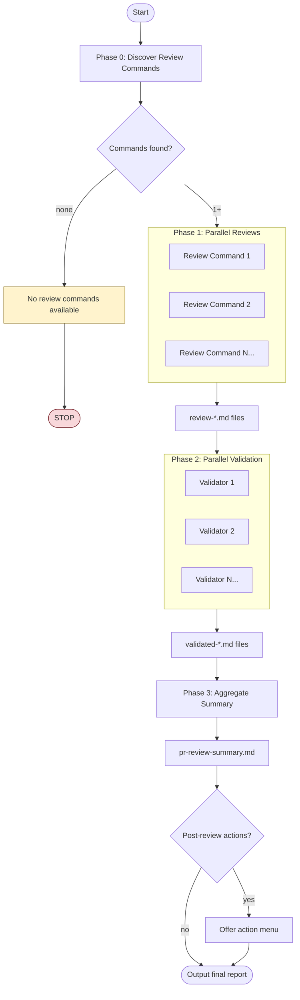

# Parallel PR Review

## CRITICAL: Task Tool Configuration

**YOU MUST USE THESE EXACT PARAMETERS.** Do NOT use specialized subagent types.

When launching review agents, each must use `subagent_type: "general-purpose"`:

```jsonc
// Each review agent - MUST use general-purpose
{
  "subagent_type": "general-purpose",
  "description": "<review-command-name> agent",
  "prompt": "Use the Skill tool to invoke <command-name> on PR #[NUMBER]. Do NOT post comments to PR. Return all findings as markdown.",
  "run_in_background": true
}
```

### Synchronization: WAIT for all agents

After launching background agents, you MUST wait for ALL to complete before
proceeding to write output files. Use `TaskOutput` tool with `block: true`:

```jsonc
// Wait for each agent - call these BEFORE writing any output files
{"task_id": "[agent-id]", "block": true, "timeout": 300000}
```

**DO NOT proceed to Phase 2 or write output files until ALL agents complete.**

### WRONG (do not do this):
- **[X]** `"subagent_type": "code-reviewer"` - Use `general-purpose` + Skill tool instead
- **[X]** `"subagent_type": "pr-review-toolkit:code-reviewer"` - Use `general-purpose` + Skill tool instead

### CORRECT (do this):
- **[OK]** `"subagent_type": "general-purpose"` - Then use Skill tool to invoke the command

---

## Overview

This skill orchestrates comprehensive PR reviews by discovering available
review commands, running them in parallel, validating their findings, and
producing an aggregated summary. Reviews are saved to markdown files and
**never posted directly to the PR**.

**Core principle:** Multiple review perspectives catch more issues. The skill
dynamically discovers whatever review commands are available in the user's
environment, rather than requiring specific plugins. Validation filters false
positives. Aggregation provides an actionable summary.

## Workflow



## Input Options

Specify what to review using these options:

| Option            | Description                        | Example            |
| ----------------- | ---------------------------------- | ------------------ |
| `--pr <number>`   | Review a specific PR               | `--pr 123`         |
| `--branch <name>` | Review branch vs main/master       | `--branch feat/x`  |
| `--files <paths>` | Review specific files only         | `--files src/*.ts` |
| `--base <ref>`    | Compare against specific base ref  | `--base develop`   |
| `--diff-only`     | Review only changed lines (default)|                    |
| `--full-context`  | Review entire files for context    |                    |

**Default behavior:** If no options specified, detect from current git state:

1. If on a branch with open PR → review that PR
2. If on a branch with uncommitted changes → review staged/unstaged changes
3. If on a branch ahead of main → review commits since divergence

## Configuration

| Option              | Description                  | Default       |
| ------------------- | ---------------------------- | ------------- |
| `--output-dir`      | Directory for review files   | `./.reviews/` |
| `--confidence`      | Min confidence threshold     | `70`          |
| `--skip-validation` | Skip Phase 2, use raw results| `false`       |
| `--revalidate`      | Re-run Phase 2-3 on existing | `false`       |

**Output directory structure:**

```text
.reviews/
└── 2024-01-23-143052/           # Timestamped run
    ├── review-<command-1>.md
    ├── review-<command-2>.md
    ├── validated-<command-1>.md
    ├── validated-<command-2>.md
    └── pr-review-summary.md
```

## Phase 0: Discover Available Review Commands

Instead of requiring specific plugins, discover what review commands are
available in the current environment.

**Where to look:** Check the list of available skills shown in the
system-reminder messages in the conversation. This list contains entries like:

```
- code-review:code-review: Code review a pull request
- coderabbit:review: Run CodeRabbit AI code review on your changes
- pr-review-toolkit:review-pr: Comprehensive PR review using specialized agents
- security-review: Complete a security review of the pending changes
```

Note that some commands use the `plugin:command` format (like
`code-review:code-review`) while others are standalone names (like
`security-review`). Look for both formats.

**Discovery rules:**

1. Scan the full list of available skills for anything related to code review,
   PR review, or security review. Match on names or descriptions containing:
   "review", "code review", "PR review", "security review", "code quality".
   Include both `plugin:command` format and standalone command names.
2. **Exclude this skill itself** (`parallel-pr-review`) and any skill whose
   name contains `parallel-pr-review` to avoid recursion.
3. Select up to 3 review commands to run in parallel. If more than 3 are
   available, prefer commands that offer different perspectives (e.g., one
   general code review, one security-focused, one style/quality focused).
4. If zero review commands are found, **STOP** and inform the user that no
   review commands are available and suggest installing review plugins.

**Report what was discovered:**

```text
Parallel PR Review - PR #123
════════════════════════════════════════

[✓] Phase 0: Discovered N review commands:
    ├── /code-review:code-review
    ├── /pr-review-toolkit:review-pr
    └── /security-review
```

## Phase 1: Parallel Review Execution

> **STOP! Before proceeding, review the "CRITICAL: Task Tool Configuration"
> section at the top of this document.** All agents use `general-purpose`.

Launch **one general-purpose agent per discovered review command** using the
Task tool in a single message. Each agent must use
`subagent_type: "general-purpose"` so it can invoke commands via the Skill tool.

**CRITICAL:** Do NOT use specialized subagent types. You must use
`general-purpose` agents that invoke the commands via the Skill tool.

**Verification checkpoint:** Before calling the Task tool, confirm:
- [ ] All agents use `"subagent_type": "general-purpose"`
- [ ] All agent prompts start with "Use the Skill tool to invoke..."
- [ ] No agent uses specialized subagent types like `code-reviewer`

### Agent prompt template

For each discovered review command, launch an agent with this prompt structure:

```markdown
**Task prompt for agent (subagent_type: "general-purpose"):**

Use the Skill tool to invoke <COMMAND_NAME> on [TARGET].

CRITICAL INSTRUCTIONS:
1. Do NOT post any comments to the PR
2. Do NOT use `gh pr comment` or any GitHub posting commands
3. Capture ALL review output including:
   - Issues found with severity levels
   - Bug detection results
   - Security concerns (if applicable)
4. Format output as structured markdown
5. Return the complete review findings

Configuration:
- Review scope: [diff-only | full-context]
- Files: [file list if specified]

Save all findings - they will be written to a markdown file.
```

### Phase 1 Output Files

**IMPORTANT:** Use `TaskOutput` with `block: true` on ALL agent IDs
before proceeding. Do NOT write output files until all agents have returned.

After all agents complete, write results to output directory. Name each file
based on the command that produced it:

- `review-<command-short-name>.md` - Output from each review command

Use a short name derived from the command (e.g., `code-review` from
`code-review:code-review`, `pr-toolkit` from `pr-review-toolkit:review-pr`,
`security` from `security-review`).

Include header in each file:

```markdown
# Code Review Results

**Source:** <command-name>
**Target:** PR #123 / branch-name
**Date:** 2024-01-23 14:30:52
**Scope:** diff-only
**Files reviewed:** 12

---
```

## Phase 2: Parallel Validation

Launch **one validation agent per review output** (using
`subagent_type: "general-purpose"`) to evaluate findings:

### Validator prompt template

```markdown
**Task prompt for Validator (Sonnet recommended):**

Read and evaluate the findings in review-<name>.md.

For each issue found:
1. Verify the issue is real (not a false positive)
2. Check if it's a pre-existing issue vs new in this PR
3. Assess severity: Critical / Important / Minor / Nitpick
4. Evaluate confidence level (0-100)
5. Check if issue is actionable

Filter criteria:
- Remove false positives
- Remove pre-existing issues not introduced by this PR
- Remove issues that linters/type checkers would catch
- Keep issues with confidence >= [CONFIDENCE_THRESHOLD]

Output: Validated findings with confidence scores and reasoning.
```

### Validation Output Files

- `validated-<command-short-name>.md` - Validated findings from each review

## Phase 3: Aggregate Summary

After validation completes, generate a comprehensive summary.

### Deduplication Rules

Issues are considered duplicates if ANY of these match:

| Criteria                       | Threshold            |
| ------------------------------ | -------------------- |
| Same file + line range         | Within 5 lines       |
| Issue description similarity   | >80% semantic match  |
| Same code snippet referenced   | Exact match          |

**When duplicates found:**

- Keep the instance with highest confidence score
- Mark source as "multiple" in Source column
- Combine unique details from all descriptions

### Aggregation Steps

1. **Deduplicate** - Identify issues found by multiple reviews
2. **Categorize** - Group by severity (Critical > Important > Suggestions)
3. **Prioritize** - Security issues first, then by confidence score
4. **Cross-reference** - Note which review(s) found each issue
5. **Synthesize** - Create actionable summary

### Final Report Structure

```markdown
# PR Review Summary

**PR:** [PR number/branch]
**Date:** [timestamp]
**Reviews Run:** [list of commands used]
**Confidence Threshold:** [threshold]%
**Output Directory:** [path]

## Executive Summary

[2-3 sentence overview of PR quality and key findings]

## Security Issues

| # | Issue | Severity | CWE | Confidence | File:Line |
|---|-------|----------|-----|------------|-----------|
| 1 | [description] | Critical | CWE-XX | [score]% | [location] |

## Critical Issues (Must Fix)

| # | Issue | Source | Confidence | File:Line |
|---|-------|--------|------------|-----------|
| 1 | [description] | [sources] | [score]% | [location] |

## Important Issues (Should Fix)

| # | Issue | Source | Confidence | File:Line |
|---|-------|--------|------------|-----------|

## Suggestions (Consider)

| # | Suggestion | Source | File:Line |
|---|------------|--------|-----------|

## Positive Observations

- [What's well-done in this PR]

## Review Agreement Analysis

- **Issues found by multiple reviews:** [count] (highest confidence)
- **Issues unique to each review:** [counts per source]
- **Agreement rate:** [percentage]%
- **Overall confidence:** [high/medium/low]

## Recommended Actions

1. [Prioritized action item - security first]
2. [Next action]
3. [...]

---

*Generated by parallel-pr-review skill*
*Review commands used: [list]*
*Review files: review-*.md*
*Validation files: validated-*.md*
```

### Phase 3 Output Files

- `pr-review-summary.md` - Final aggregated report

## Post-Review Actions

After summary is generated, offer an action menu:

```text
Review complete! Found N security, N critical, N important issues.

What would you like to do?

1. [View] Open pr-review-summary.md
2. [Fix] Generate fix suggestions for critical issues
3. [Issues] Create GitHub issues for tracking
4. [Comment] Post summary to PR (requires approval)
5. [Rerun] Re-run review on specific files
6. [Done] Exit

Select action (1-6):
```

### Action Details

| Action      | Description              | Notes                       |
| ----------- | ------------------------ | --------------------------- |
| **View**    | Open summary in editor   | Default action              |
| **Fix**     | Generate fix suggestions | Creates `fix-suggestions.md`|
| **Issues**  | Create GitHub issues     | One issue per critical item |
| **Comment** | Post to PR               | Requires user approval      |
| **Rerun**   | Re-run on subset         | Useful after partial fixes  |
| **Done**    | Exit skill               | No further action           |

## Usage Examples

### Basic usage (auto-detect)

```bash
Run parallel-pr-review
```

### Review specific PR

```bash
Run parallel-pr-review --pr 123
```

### Review with custom settings

```bash
Run parallel-pr-review --pr 123 --confidence 80 --output-dir ./my-reviews
```

### Skip validation phase

```bash
Run parallel-pr-review --skip-validation
```

### Re-run validation on existing results

```bash
Run parallel-pr-review --revalidate --output-dir ./.reviews/2024-01-23-143052
```

### Review specific files

```bash
Run parallel-pr-review --files src/auth/*.ts src/api/login.ts
```

### Full context review (not just diff)

```bash
Run parallel-pr-review --pr 123 --full-context
```

## Output Files Summary

| File                           | Phase | Contents                         |
| ------------------------------ | ----- | -------------------------------- |
| `review-<command>.md`          | 1     | Raw output from each reviewer    |
| `validated-<command>.md`       | 2     | Validated findings per reviewer  |
| `pr-review-summary.md`        | 3     | Final aggregated summary         |
| `fix-suggestions.md`          | Post  | Fix suggestions (optional)       |

## Important Constraints

**DO NOT post to PR:**

- Never use `gh pr comment`
- Never use `gh pr review`
- All output goes to markdown files only
- User decides what (if anything) to post
- Post action requires explicit approval

**Parallel execution:**

- Phase 1: All reviews run simultaneously
- Phase 2: All validators run simultaneously
- Use single Task tool message with multiple invocations for parallelism

## Error Handling

| Scenario                      | Behavior                             |
| ----------------------------- | ------------------------------------ |
| One command fails in Phase 1  | Continue with available, warn user   |
| All commands fail in Phase 1  | Abort with error details             |
| Validation fails              | Use unvalidated results with warning |
| Output directory not writable | Fallback to current directory        |
| PR not found                  | Prompt for correct PR number         |
| No changes detected           | Exit with "nothing to review" message|

**Always produce summary even with partial results** - indicate which
phases succeeded/failed.

## Model Recommendations

| Phase | Task              | Model  | Rationale                     |
| ----- | ----------------- | ------ | ----------------------------- |
| 0     | Discover commands | Haiku  | Simple discovery task         |
| 1     | Run reviews       | Opus   | Deep analysis, high quality   |
| 2     | Validate findings | Sonnet | Filtering needs good judgment |
| 3     | Aggregate summary | Opus   | Synthesis needs reasoning     |

When spawning subagents with the Task tool, you may specify a `model`
parameter (e.g., `"model": "haiku"`) but this is a hint, not a guarantee.
