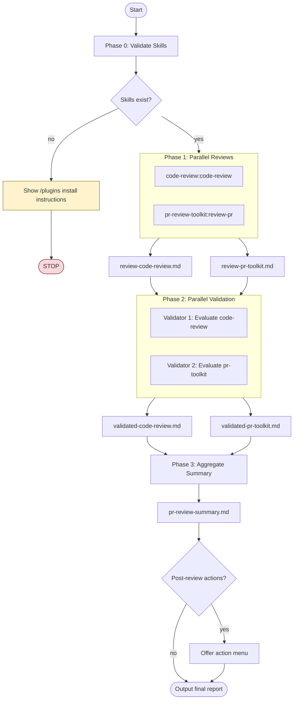

# Parallel PR Review

## Overview

This skill orchestrates comprehensive PR reviews by running two independent review methodologies in parallel, validating their findings, and producing an aggregated summary. Reviews are saved to markdown files and **never posted directly to the PR**.

**Core principle:** Multiple review perspectives catch more issues. Validation filters false positives. Aggregation provides actionable summary.

## Workflow



## Input Options

Specify what to review using these options:

| Option | Description | Example |
|--------|-------------|---------|
| `--pr <number>` | Review a specific PR | `--pr 123` |
| `--branch <name>` | Review changes on branch vs main/master | `--branch feature/auth` |
| `--files <paths>` | Review specific files only | `--files src/auth.ts src/login.ts` |
| `--base <ref>` | Compare against specific base ref | `--base develop` |
| `--diff-only` | Review only changed lines (default) | |
| `--full-context` | Review entire files for full context | |

**Default behavior:** If no options specified, detect from current git state:
1. If on a branch with open PR → review that PR
2. If on a branch with uncommitted changes → review staged/unstaged changes
3. If on a branch ahead of main → review commits since divergence

## Configuration

| Option | Description | Default |
|--------|-------------|---------|
| `--output-dir <path>` | Directory for review files | `./.reviews/` |
| `--confidence <0-100>` | Minimum confidence threshold | `70` |
| `--skip-validation` | Skip Phase 2, use raw results | `false` |
| `--only <skill>` | Run only one review skill | both |
| `--revalidate` | Re-run Phase 2-3 on existing files | `false` |

**Output directory structure:**
```
.reviews/
└── 2024-01-23-143052/           # Timestamped run
    ├── review-code-review.md
    ├── review-pr-toolkit.md
    ├── validated-code-review.md
    ├── validated-pr-toolkit.md
    └── pr-review-summary.md
```

## Model Selection

Optimize for quality by using appropriate models per phase:

| Phase | Task | Model | Rationale |
|-------|------|-------|-----------|
| 0 | Validate skills | Haiku | Simple existence check |
| 1 | Run reviews | Opus | Deep analysis, highest quality |
| 2 | Validate findings | Sonnet | Filtering/scoring needs good judgment |
| 3 | Aggregate summary | Opus | Synthesis needs advanced reasoning |

## Progress Reporting

Display progress during execution:

```
Parallel PR Review - PR #123
════════════════════════════════════════

[✓] Phase 0: Validating skills... (2 found)
[⋯] Phase 1: Running parallel reviews...
    ├── [✓] code-review:code-review (12 issues)
    └── [⋯] pr-review-toolkit:review-pr...
[ ] Phase 2: Validating findings...
[ ] Phase 3: Aggregating summary...

Output: .reviews/2024-01-23-143052/
```

## Phase 0: Validate Required Skills

Before proceeding, verify both required skills are available:

1. **code-review:code-review** - Claude Code's built-in PR review skill
2. **pr-review-toolkit:review-pr** - Comprehensive multi-agent PR review toolkit

**Validation steps:**

1. Check if both plugins are installed by looking for them in the available skills/commands
2. If either skill is missing, **STOP** and display the following message:

```
Missing required plugin(s). Install using /plugins command:

/plugins install code-review from claude-plugins-official
/plugins install pr-review-toolkit from claude-plugins-official

After installation, run this skill again.
```

3. Only proceed to Phase 1 if BOTH skills are confirmed available

## Phase 1: Parallel Review Execution

Launch **two subagents in parallel** using the Task tool in a single message:

### Subagent 1: code-review:code-review

```markdown
**Task prompt for Subagent 1:**

Run the code-review:code-review skill on [TARGET].

CRITICAL INSTRUCTIONS:
1. Do NOT post any comments to the PR
2. Do NOT use `gh pr comment` or any GitHub posting commands
3. Capture ALL review output including:
   - Issues found with severity levels
   - CLAUDE.md compliance checks
   - Bug detection results
   - Historical context findings
4. Format output as structured markdown
5. Return the complete review findings

Configuration:
- Review scope: [diff-only | full-context]
- Files: [file list if specified]

Save all findings - they will be written to a markdown file.
```

### Subagent 2: pr-review-toolkit:review-pr

```markdown
**Task prompt for Subagent 2:**

Run the pr-review-toolkit:review-pr skill with "all" aspects on [TARGET].

CRITICAL INSTRUCTIONS:
1. Do NOT post any comments to the PR
2. Do NOT use `gh pr comment` or any GitHub posting commands
3. Run all review aspects: comments, tests, errors, types, code, simplify
4. Capture ALL review output including:
   - Critical issues
   - Important issues
   - Suggestions
   - Positive observations
5. Format output as structured markdown
6. Return the complete review findings

Configuration:
- Review scope: [diff-only | full-context]
- Files: [file list if specified]

Save all findings - they will be written to a markdown file.
```

### Output Files

After both subagents complete, write results to output directory:

- `review-code-review.md` - Output from code-review:code-review
- `review-pr-toolkit.md` - Output from pr-review-toolkit:review-pr

Include header in each file:
```markdown
# Code Review Results

**Source:** code-review:code-review
**Target:** PR #123 / branch-name
**Date:** 2024-01-23 14:30:52
**Scope:** diff-only
**Files reviewed:** 12

---
```

## Phase 2: Parallel Validation

Launch **two validation subagents in parallel** to evaluate the review findings:

### Validator 1: Evaluate code-review findings

```markdown
**Task prompt for Validator 1 (Haiku):**

Read and evaluate the findings in review-code-review.md.

For each issue found:
1. Verify the issue is real (not a false positive)
2. Check if it's a pre-existing issue vs new in this PR
3. Assess severity: Critical / Important / Minor / Nitpick
4. Evaluate confidence level (0-100)
5. Check if issue is actionable

Filter criteria:
- Remove false positives
- Remove pre-existing issues not introduced by this PR
- Remove issues that linters/type checkers would catch
- Keep issues with confidence >= [CONFIDENCE_THRESHOLD]

Output: Validated findings with confidence scores and reasoning.
```

### Validator 2: Evaluate pr-review-toolkit findings

```markdown
**Task prompt for Validator 2 (Haiku):**

Read and evaluate the findings in review-pr-toolkit.md.

For each issue found:
1. Verify the issue is real (not a false positive)
2. Check if it's a pre-existing issue vs new in this PR
3. Assess severity: Critical / Important / Minor / Nitpick
4. Evaluate confidence level (0-100)
5. Check if issue is actionable

Filter criteria:
- Remove false positives
- Remove pre-existing issues not introduced by this PR
- Remove issues that linters/type checkers would catch
- Keep issues with confidence >= [CONFIDENCE_THRESHOLD]

Output: Validated findings with confidence scores and reasoning.
```

### Validation Output Files

- `validated-code-review.md` - Validated findings from code-review
- `validated-pr-toolkit.md` - Validated findings from pr-review-toolkit

## Phase 3: Aggregate Summary

After validation completes, generate a comprehensive summary:

### Deduplication Rules

Issues are considered duplicates if ANY of these match:

| Criteria | Threshold |
|----------|-----------|
| Same file + line range | Within 5 lines |
| Issue description similarity | >80% semantic match |
| Same code snippet referenced | Exact match |

**When duplicates found:**
- Keep the instance with highest confidence score
- Mark as "Found by both reviews" in Source column
- Combine unique details from both descriptions

### Aggregation Steps

1. **Deduplicate** - Identify issues found by both reviews using rules above
2. **Categorize** - Group by severity (Critical > Important > Suggestions)
3. **Prioritize** - Order by confidence score within categories
4. **Cross-reference** - Note which review(s) found each issue
5. **Synthesize** - Create actionable summary

### Final Report Structure

```markdown
# PR Review Summary

**PR:** [PR number/branch]
**Date:** [timestamp]
**Reviews Run:** code-review:code-review, pr-review-toolkit:review-pr
**Confidence Threshold:** [threshold]%
**Output Directory:** [path]

## Executive Summary

[2-3 sentence overview of PR quality and key findings]

## Critical Issues (Must Fix)

| # | Issue | Source | Confidence | File:Line |
|---|-------|--------|------------|-----------|
| 1 | [description] | [both/code-review/pr-toolkit] | [score]% | [location] |

## Important Issues (Should Fix)

| # | Issue | Source | Confidence | File:Line |
|---|-------|--------|------------|-----------|

## Suggestions (Consider)

| # | Suggestion | Source | File:Line |
|---|------------|--------|-----------|

## Positive Observations

- [What's well-done in this PR]

## Review Agreement Analysis

- **Issues found by both reviews:** [count] (high confidence)
- **Issues unique to code-review:** [count]
- **Issues unique to pr-review-toolkit:** [count]
- **Agreement rate:** [percentage]%
- **Overall confidence:** [high/medium/low]

## Recommended Actions

1. [Prioritized action item]
2. [Next action]
3. [...]

---

*Generated by parallel-pr-review skill*
*Review files: review-code-review.md, review-pr-toolkit.md*
*Validation files: validated-code-review.md, validated-pr-toolkit.md*
```

### Output Files

- `pr-review-summary.md` - Final aggregated report

## Post-Review Actions

After summary is generated, offer an action menu:

```
Review complete! Found 3 critical, 5 important issues.

What would you like to do?

1. [View] Open pr-review-summary.md
2. [Fix] Generate fix suggestions for critical issues
3. [Issues] Create GitHub issues for tracking
4. [Comment] Post summary to PR (requires approval)
5. [Rerun] Re-run review on specific files
6. [Done] Exit

Select action (1-6):
```

### Action Details

| Action | Description | Notes |
|--------|-------------|-------|
| **View** | Open summary in editor/pager | Default action |
| **Fix** | Generate code fix suggestions | Creates `fix-suggestions.md` |
| **Issues** | Create GitHub issues | One issue per critical item |
| **Comment** | Post to PR | Requires explicit user approval |
| **Rerun** | Re-run on subset | Useful after partial fixes |
| **Done** | Exit skill | No further action |

## Usage Examples

### Basic usage (auto-detect)

```
Run parallel-pr-review
```

### Review specific PR

```
Run parallel-pr-review --pr 123
```

### Review with custom settings

```
Run parallel-pr-review --pr 123 --confidence 80 --output-dir ./my-reviews
```

### Review only with one skill

```
Run parallel-pr-review --only code-review
Run parallel-pr-review --only pr-toolkit
```

### Skip validation phase

```
Run parallel-pr-review --skip-validation
```

### Re-run validation on existing results

```
Run parallel-pr-review --revalidate --output-dir ./.reviews/2024-01-23-143052
```

### Review specific files

```
Run parallel-pr-review --files src/auth/*.ts src/api/login.ts
```

### Full context review (not just diff)

```
Run parallel-pr-review --pr 123 --full-context
```

## Output Files Summary

| File | Phase | Contents |
|------|-------|----------|
| `review-code-review.md` | 1 | Raw output from code-review skill |
| `review-pr-toolkit.md` | 1 | Raw output from pr-review-toolkit skill |
| `validated-code-review.md` | 2 | Validated/filtered code-review findings |
| `validated-pr-toolkit.md` | 2 | Validated/filtered pr-toolkit findings |
| `pr-review-summary.md` | 3 | Final aggregated summary |
| `fix-suggestions.md` | Post | Generated fix suggestions (optional) |

## Important Constraints

**DO NOT post to PR:**
- Never use `gh pr comment`
- Never use `gh pr review`
- All output goes to markdown files only
- User decides what (if anything) to post
- Post action requires explicit approval

**Parallel execution:**
- Phase 1: Both reviews run simultaneously
- Phase 2: Both validators run simultaneously
- Use single Task tool message with multiple invocations for true parallelism

## Error Handling

| Scenario | Behavior |
|----------|----------|
| One skill fails in Phase 1 | Continue with available results, warn user |
| Both skills fail in Phase 1 | Abort with error details |
| Validation fails | Use unvalidated results with warning |
| Output directory not writable | Fallback to current directory |
| PR not found | Prompt for correct PR number |
| No changes detected | Exit with "nothing to review" message |

**Always produce summary even with partial results** - indicate which phases succeeded/failed.

## Selective Execution

| Flag | Skips | Use Case |
|------|-------|----------|
| `--only code-review` | pr-review-toolkit | Quick CLAUDE.md compliance check |
| `--only pr-toolkit` | code-review | Comprehensive multi-aspect review |
| `--skip-validation` | Phase 2 | Trust raw results, faster execution |
| `--revalidate` | Phase 1 | Re-filter with different threshold |
