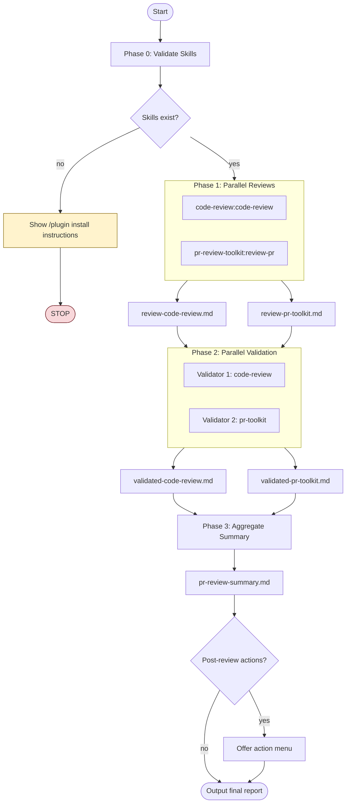

# Parallel PR Review

## CRITICAL: Task Tool Configuration

**YOU MUST USE THESE EXACT PARAMETERS.** Do NOT use specialized subagent types.

### Phase 1: Launch TWO agents in ONE message

```jsonc
// Agent 1 - MUST use general-purpose, NOT code-reviewer
{
  "subagent_type": "general-purpose",
  "description": "Code review command agent",
  "prompt": "Use the Skill tool to invoke code-review:code-review on PR #[NUMBER]. Do NOT post comments to PR. Return all findings as markdown.",
  "run_in_background": true
}

// Agent 2 - MUST use general-purpose, NOT pr-review-toolkit:code-reviewer
{
  "subagent_type": "general-purpose",
  "description": "PR toolkit command agent",
  "prompt": "Use the Skill tool to invoke pr-review-toolkit:review-pr with 'all' aspects on PR #[NUMBER]. Do NOT post comments to PR. Return all findings as markdown.",
  "run_in_background": true
}
```

> **Note:** The `review-pr` command internally orchestrates multiple specialized
> agents, so two top-level agents provide comprehensive coverage.

### Synchronization: WAIT for all agents

After launching background agents, you MUST wait for ALL to complete before
proceeding to write output files. Use `TaskOutput` tool with `block: true`:

```jsonc
// Wait for each agent - call these BEFORE writing any output files
{"task_id": "[agent-1-id]", "block": true, "timeout": 300000}
{"task_id": "[agent-2-id]", "block": true, "timeout": 300000}
```

**DO NOT proceed to Phase 2 or write output files until BOTH agents complete.**

### WRONG (do not do this):
- **[X]** `"subagent_type": "code-reviewer"` - Use `general-purpose` + Skill tool instead
- **[X]** `"subagent_type": "pr-review-toolkit:code-reviewer"` - Use `general-purpose` + Skill tool instead

### CORRECT (do this):
- **[OK]** `"subagent_type": "general-purpose"` - Then use Skill tool to invoke the command

---

## Overview

This skill orchestrates comprehensive PR reviews by running two independent
review commands in parallel, validating their findings, and producing an
aggregated summary. Reviews are saved to markdown files and **never posted
directly to the PR**.

**Core principle:** Multiple review perspectives catch more issues. The
`review-pr` command internally orchestrates multiple specialized agents
(including error handling and security analysis). Validation filters false
positives. Aggregation provides actionable summary.

## Workflow

> **Note:** The diagram below uses Mermaid syntax. If it doesn't render
> in your viewer, see the ASCII version in [README.md](README.md#how-it-works).



## Input Options

Specify what to review using these options:

| Option            | Description                        | Example            |
| ----------------- | ---------------------------------- | ------------------ |
| `--pr <number>`   | Review a specific PR               | `--pr 123`         |
| `--branch <name>` | Review branch vs main/master       | `--branch feat/x`  |
| `--files <paths>` | Review specific files only         | `--files src/*.ts` |
| `--base <ref>`    | Compare against specific base ref  | `--base develop`   |
| `--diff-only`     | Review only changed lines (default)|                    |
| `--full-context`  | Review entire files for context    |                    |

**Default behavior:** If no options specified, detect from current git state:

1. If on a branch with open PR → review that PR
2. If on a branch with uncommitted changes → review staged/unstaged changes
3. If on a branch ahead of main → review commits since divergence

## Configuration

| Option              | Description                  | Default       |
| ------------------- | ---------------------------- | ------------- |
| `--output-dir`      | Directory for review files   | `./.reviews/` |
| `--confidence`      | Min confidence threshold     | `70`          |
| `--skip-validation` | Skip Phase 2, use raw results| `false`       |
| `--only <skill>`    | Run subset of reviewers      | all           |
| `--revalidate`      | Re-run Phase 2-3 on existing | `false`       |

> **Naming convention:** `pr-toolkit` = pr-review-toolkit. This shorthand is
> used in options and output file names.

**Output directory structure:**

```text
.reviews/
└── 2024-01-23-143052/           # Timestamped run
    ├── review-code-review.md
    ├── review-pr-toolkit.md
    ├── validated-code-review.md
    ├── validated-pr-toolkit.md
    └── pr-review-summary.md
```

## Model Recommendations

The following model recommendations optimize for quality per phase. Note
that actual model selection depends on user configuration and Claude Code
settings - this skill cannot enforce specific models.

| Phase | Task              | Model  | Rationale                     |
| ----- | ----------------- | ------ | ----------------------------- |
| 0     | Validate skills   | Haiku  | Simple existence check        |
| 1     | Run reviews       | Opus   | Deep analysis, high quality   |
| 2     | Validate findings | Sonnet | Filtering needs good judgment |
| 3     | Aggregate summary | Opus   | Synthesis needs reasoning     |

When spawning subagents with the Task tool, you may specify a `model`
parameter (e.g., `"model": "haiku"`) but this is a hint, not a guarantee.

## Progress Reporting

Display progress during execution:

```text
Parallel PR Review - PR #123
════════════════════════════════════════

[✓] Phase 0: Validating plugins... (2 found)
[⋯] Phase 1: Running parallel reviews...
    ├── [✓] code-review:code-review (12 issues)
    └── [⋯] pr-review-toolkit:review-pr...
[ ] Phase 2: Validating findings...
[ ] Phase 3: Aggregating summary...

Output: .reviews/2024-01-23-143052/
```

## Phase 0: Validate Required Plugins

Before proceeding, verify required plugins are installed:

1. **code-review:code-review** - Claude Code's built-in PR review command
2. **pr-review-toolkit:review-pr** - Comprehensive multi-agent PR review command

> **Note:** The `review-pr` command internally orchestrates multiple specialized
> agents, providing comprehensive coverage with just two top-level agents.

**Validation steps:**

1. Check if both plugins are installed by looking for them in the
   available skills/commands
2. If any plugin is missing, **STOP** and display the following message:

```text
Missing required plugin(s). Install using /plugin command:

/plugin install code-review@claude-plugins-official
/plugin install pr-review-toolkit@claude-plugins-official

After installation, run this skill again.
```

3. Only proceed to Phase 1 if both plugins are confirmed available

## Phase 1: Parallel Review Execution

> **STOP! Before proceeding, review the "CRITICAL: Task Tool Configuration"
> section at the top of this document.** Both agents use `general-purpose`.

Launch **two general-purpose agents in parallel** using the Task tool in a
single message. Each agent must use `subagent_type: "general-purpose"` so it
can invoke commands via the Skill tool.

**CRITICAL:** Do NOT use specialized subagent types like `code-reviewer` or
`pr-review-toolkit:code-reviewer`. You must use `general-purpose` agents that
invoke the commands via the Skill tool.

**Verification checkpoint:** Before calling the Task tool, confirm:
- [ ] Both agents use `"subagent_type": "general-purpose"`
- [ ] Both agent prompts start with "Use the Skill tool to invoke..."
- [ ] No agent uses `code-reviewer` or `pr-review-toolkit:code-reviewer`

### Agent 1: code-review:code-review

```markdown
**Task prompt for Agent 1 (subagent_type: "general-purpose"):**

Use the Skill tool to invoke the code-review:code-review skill on [TARGET].

CRITICAL INSTRUCTIONS:
1. Do NOT post any comments to the PR
2. Do NOT use `gh pr comment` or any GitHub posting commands
3. Capture ALL review output including:
   - Issues found with severity levels
   - CLAUDE.md compliance checks
   - Bug detection results
   - Historical context findings
4. Format output as structured markdown
5. Return the complete review findings

Configuration:
- Review scope: [diff-only | full-context]
- Files: [file list if specified]

Save all findings - they will be written to a markdown file.
```

### Agent 2: pr-review-toolkit:review-pr

```markdown
**Task prompt for Agent 2 (subagent_type: "general-purpose"):**

Use the Skill tool to invoke the pr-review-toolkit:review-pr skill with "all" aspects on [TARGET].

CRITICAL INSTRUCTIONS:
1. Do NOT post any comments to the PR
2. Do NOT use `gh pr comment` or any GitHub posting commands
3. Run all review aspects: comments, tests, errors, types, code, simplify
4. Capture ALL review output including:
   - Critical issues
   - Important issues
   - Suggestions
   - Positive observations
5. Format output as structured markdown
6. Return the complete review findings

Configuration:
- Review scope: [diff-only | full-context]
- Files: [file list if specified]

Save all findings - they will be written to a markdown file.
```

### Phase 1 Output Files

**IMPORTANT:** Use `TaskOutput` with `block: true` on BOTH agent IDs
before proceeding. Do NOT write output files until both agents have returned.

After both agents complete, write results to output directory:

- `review-code-review.md` - Output from code-review:code-review
- `review-pr-toolkit.md` - Output from pr-review-toolkit:review-pr

Include header in each file:

```markdown
# Code Review Results

**Source:** code-review:code-review
**Target:** PR #123 / branch-name
**Date:** 2024-01-23 14:30:52
**Scope:** diff-only
**Files reviewed:** 12

---
```

## Phase 2: Parallel Validation

Launch **two validation agents in parallel** (using `subagent_type: "general-purpose"`) to evaluate findings:

### Validator 1: Evaluate code-review findings

```markdown
**Task prompt for Validator 1 (Sonnet recommended):**

Read and evaluate the findings in review-code-review.md.

For each issue found:
1. Verify the issue is real (not a false positive)
2. Check if it's a pre-existing issue vs new in this PR
3. Assess severity: Critical / Important / Minor / Nitpick
4. Evaluate confidence level (0-100)
5. Check if issue is actionable

Filter criteria:
- Remove false positives
- Remove pre-existing issues not introduced by this PR
- Remove issues that linters/type checkers would catch
- Keep issues with confidence >= [CONFIDENCE_THRESHOLD]

Output: Validated findings with confidence scores and reasoning.
```

### Validator 2: Evaluate pr-review-toolkit findings

```markdown
**Task prompt for Validator 2 (Sonnet recommended):**

Read and evaluate the findings in review-pr-toolkit.md.

For each issue found:
1. Verify the issue is real (not a false positive)
2. Check if it's a pre-existing issue vs new in this PR
3. Assess severity: Critical / Important / Minor / Nitpick
4. Evaluate confidence level (0-100)
5. Check if issue is actionable

Filter criteria:
- Remove false positives
- Remove pre-existing issues not introduced by this PR
- Remove issues that linters/type checkers would catch
- Keep issues with confidence >= [CONFIDENCE_THRESHOLD]

Output: Validated findings with confidence scores and reasoning.
```

### Validation Output Files

- `validated-code-review.md` - Validated findings from code-review
- `validated-pr-toolkit.md` - Validated findings from pr-review-toolkit

## Phase 3: Aggregate Summary

After validation completes, generate a comprehensive summary:

### Deduplication Rules

Issues are considered duplicates if ANY of these match:

| Criteria                       | Threshold            |
| ------------------------------ | -------------------- |
| Same file + line range         | Within 5 lines       |
| Issue description similarity   | >80% semantic match  |
| Same code snippet referenced   | Exact match          |

**When duplicates found:**

- Keep the instance with highest confidence score
- Mark source as "both" in Source column
- Combine unique details from all descriptions

### Aggregation Steps

1. **Deduplicate** - Identify issues found by multiple reviews
2. **Categorize** - Group by severity (Critical > Important > Suggestions)
3. **Prioritize** - Security issues first, then by confidence score
4. **Cross-reference** - Note which review(s) found each issue
5. **Synthesize** - Create actionable summary

### Final Report Structure

```markdown
# PR Review Summary

**PR:** [PR number/branch]
**Date:** [timestamp]
**Reviews Run:** code-review, pr-review-toolkit
**Confidence Threshold:** [threshold]%
**Output Directory:** [path]

## Executive Summary

[2-3 sentence overview of PR quality and key findings]

## Security Issues

| # | Issue | Severity | CWE | Confidence | File:Line |
|---|-------|----------|-----|------------|-----------|
| 1 | [description] | Critical | CWE-XX | [score]% | [location] |

## Critical Issues (Must Fix)

| # | Issue | Source | Confidence | File:Line |
|---|-------|--------|------------|-----------|
| 1 | [description] | [both/single] | [score]% | [location] |

## Important Issues (Should Fix)

| # | Issue | Source | Confidence | File:Line |
|---|-------|--------|------------|-----------|

## Suggestions (Consider)

| # | Suggestion | Source | File:Line |
|---|------------|--------|-----------|

## Positive Observations

- [What's well-done in this PR]

## Review Agreement Analysis

- **Issues found by both reviews:** [count] (highest confidence)
- **Issues unique to code-review:** [count]
- **Issues unique to pr-review-toolkit:** [count]
- **Agreement rate:** [percentage]%
- **Overall confidence:** [high/medium/low]

## Recommended Actions

1. [Prioritized action item - security first]
2. [Next action]
3. [...]

---

*Generated by parallel-pr-review skill*
*Review files: review-code-review.md, review-pr-toolkit.md*
*Validation files: validated-*.md*
```

### Phase 3 Output Files

- `pr-review-summary.md` - Final aggregated report

## Post-Review Actions

After summary is generated, offer an action menu:

```text
Review complete! Found 2 security, 3 critical, 5 important issues.

What would you like to do?

1. [View] Open pr-review-summary.md
2. [Fix] Generate fix suggestions for critical issues
3. [Issues] Create GitHub issues for tracking
4. [Comment] Post summary to PR (requires approval)
5. [Rerun] Re-run review on specific files
6. [Done] Exit

Select action (1-6):
```

### Action Details

| Action      | Description              | Notes                       |
| ----------- | ------------------------ | --------------------------- |
| **View**    | Open summary in editor   | Default action              |
| **Fix**     | Generate fix suggestions | Creates `fix-suggestions.md`|
| **Issues**  | Create GitHub issues     | One issue per critical item |
| **Comment** | Post to PR               | Requires user approval      |
| **Rerun**   | Re-run on subset         | Useful after partial fixes  |
| **Done**    | Exit skill               | No further action           |

## Usage Examples

### Basic usage (auto-detect)

```bash
Run parallel-pr-review
```

### Review specific PR

```bash
Run parallel-pr-review --pr 123
```

### Review with custom settings

```bash
Run parallel-pr-review --pr 123 --confidence 80 --output-dir ./my-reviews
```

### Review with specific reviewer only

```bash
Run parallel-pr-review --only code-review
Run parallel-pr-review --only pr-toolkit
```

### Skip validation phase

```bash
Run parallel-pr-review --skip-validation
```

### Re-run validation on existing results

```bash
Run parallel-pr-review --revalidate --output-dir ./.reviews/2024-01-23-143052
```

### Review specific files

```bash
Run parallel-pr-review --files src/auth/*.ts src/api/login.ts
```

### Full context review (not just diff)

```bash
Run parallel-pr-review --pr 123 --full-context
```

## Output Files Summary

| File                       | Phase | Contents                       |
| -------------------------- | ----- | ------------------------------ |
| `review-code-review.md`    | 1     | Raw output from code-review    |
| `review-pr-toolkit.md`     | 1     | Raw output from pr-toolkit     |
| `validated-code-review.md` | 2     | Validated code-review findings |
| `validated-pr-toolkit.md`  | 2     | Validated pr-toolkit findings  |
| `pr-review-summary.md`     | 3     | Final aggregated summary       |
| `fix-suggestions.md`       | Post  | Fix suggestions (optional)     |

## Important Constraints

**DO NOT post to PR:**

- Never use `gh pr comment`
- Never use `gh pr review`
- All output goes to markdown files only
- User decides what (if anything) to post
- Post action requires explicit approval

**Parallel execution:**

- Phase 1: Both reviews run simultaneously
- Phase 2: Both validators run simultaneously
- Use single Task tool message with multiple invocations for parallelism

## Error Handling

| Scenario                      | Behavior                             |
| ----------------------------- | ------------------------------------ |
| One skill fails in Phase 1    | Continue with available, warn user   |
| All skills fail in Phase 1    | Abort with error details             |
| Validation fails              | Use unvalidated results with warning |
| Output directory not writable | Fallback to current directory        |
| PR not found                  | Prompt for correct PR number         |
| No changes detected           | Exit with "nothing to review" message|

**Always produce summary even with partial results** - indicate which
phases succeeded/failed.

## Selective Execution

| Flag                 | Skips       | Use Case                    |
| -------------------- | ----------- | --------------------------- |
| `--only code-review` | pr-toolkit  | Quick CLAUDE.md compliance  |
| `--only pr-toolkit`  | code-review | Multi-aspect review         |
| `--skip-validation`  | Phase 2     | Trust raw results, faster   |
| `--revalidate`       | Phase 1     | Re-filter with new threshold|
